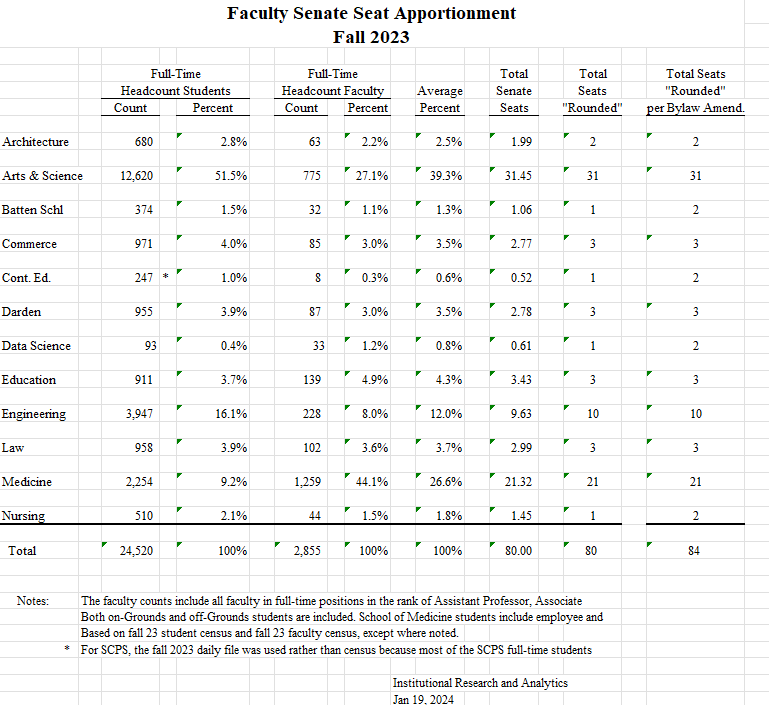

Handbook of the Faculty Senate of the University of Virginia
============================================================

Version: June 20, 2024

## Table of Contents

- [Constitution and By-Laws](#constitution-and-by-laws)
- [Preamble to Handbook](#preamble-to-handbook)
- [The Full Faculty Senate](#the-full-faculty-senate)
    - [Origin of the Faculty Senate](#origin-of-the-faculty-senate)
    - [Role of the Faculty Senate](#role-of-the-faculty-senate)
    - [Senate Membership](#senate-membership)
    - [Reapportionment of Senator Seats](#reapportionment-of-senator-seats)
    - [Procedures for Choosing Senators](#procedures-for-choosing-senators)
    - [Recurring Senate Actions by Date](#recurring-senate-actions-by-date)
    - [Senate Office Election Procedures](#senate-office-election-procedures)
    - [Faculty Senate Communications](#faculty-senate-communications)
- [Senate Meetings](#senate-meetings)
    - [Scheduling of Regular Meetings](#scheduling-of-regular-meetings)
    - [New Matters](#new-matters)
    - [Agenda](#agenda)
    - [Procedures](#procedures)
    - [Voting (non-electoral)](#voting-non-electoral)
- [Responsibilities by Position](#responsibilities-by-position)
    - [Senators](#senators)
    - [Chair](#chair)
    - [Immediate Past Chair](#immediate-past-chair)
    - [Chair-Elect](#chair-elect)
    - [Faculty Representative to the Board of Visitors](#faculty-representative-to-the-board-of-visitors)
    - [Parliamentarian](#parliamentarian)
    - [Committee Chairs](#committee-chairs)
    - [Administrative Support](#administrative-support)
    - [Secretary (not in use)](#secretary-not-in-use)
- [The Executive Council](#the-executive-council)
    - [Role of the Executive Council](#role-of-the-executive-council)
    - [Composition](#composition)
- [Committees of the Senate](#committees-of-the-senate)
    - [Role of Committees](#role-of-committees)
    - [Member Appointment and Chair Election Procedures](#member-appointment-and-chair-election-procedures)
    - [Operations](#operations)
- [Data Management (Materials and Records)](#data-management-materials-and-records)
    - [Faculty Senate and Committee UVA Boxes](#faculty-senate-&-committee-uva-boxes)
- [Budgeting and Financial Information](#budgeting-and-financial-information)
- [Faculty Senate-related Policies](#faculty-senate-related-policies)
- [Appendices](#appendices)
    - [Declaring Conflict or Duality of Interest](#declaring-conflict-or-duality-of-interest)

## Constitution and By-Laws

The Constitution and By-Laws of the Faculty Senate can be found on the Faculty Senate Website: [https://facultysenate.virginia.edu/content/about](https://facultysenate.virginia.edu/content/about).

## Preamble to Handbook

This Handbook is not intended to make additions to, conflict with, or in any way substitute for the Constitution and By-Laws of the Faculty Senate of the University of Virginia as ratified and amended. Instead, this document is designed for use as a reference and guide to the operations and conventions of the Faculty Senate as they have evolved to exist today. The Handbook aims to provide greater institutional memory among Senate members over time and to improve the efficiency and transparency of the Senate. This Handbook is considered a living document that will be periodically updated when necessary. New senators are asked to read this Handbook as part of their orientation to the Senate, while veteran senators are encouraged to review it as needed. 

## The Full Faculty Senate

### Origin of the Faculty Senate

When the faculty of the University grew to ninety-seven, President Alderman expressed his belief that it had "become too large to function successfully as a legislative body." The General Faculty recommended formation of the University Senate, which first convened in 1926. This body was named the Faculty Senate in 1971 when a new constitution was ratified, the document which is used as amended today.

### Role of the Faculty Senate

The Constitution and By-Laws holds that the Faculty Senate "represents all faculties of the University with respect to all academic functions such as the establishment and termination of degree programs, major modifications of requirements for existing degrees, and action affecting all faculties, or more than one faculty, of the University" *(II.A)* and *(II.B)*. It also establishes the Senate's advisory function for the President and the Rector and Board of Visitors "concerning educational and related matters affecting the welfare of the University." These functions relate to the Senate's role as "a deliberative body." The Senate's role is linked to the responsibility of each Senator "to engage in the work of the Senate and its committees, to represent the interests and concerns of colleagues to the Senate, and to report regularly the proceedings of the Senate to his or her constituency" *(VI)*.

The Senate is additionally granted "authority to determine the responsibilities and prerogatives of the Executive Council," and "may create rules that specify the Executive Council's responsibilities and may review actions by the Executive Council according to procedures determined by the Senate" *(VII.B.ix.a)*. Further, when made in response to a need for prompt action, any Executive Council actions done on behalf of the Senate must be voted on for ratification by the full Senate itself *(VII.B.viii.a)*. 

### Senate Membership

#### Eligibility

Eligibility for election to the Senate applies to those "appointed to a salaried faculty position at the University of Virginia at Charlottesville, except for those who are *ex officio* members of the Senate, as enumerated below." *(III)*. *Ex officio* membership with voice and without vote to the Senate is extended to the President, the University Vice-Presidents, the Deans of the Schools of the University, and the University Librarian *(IV.A.i.iv)*. The exception to this rule extends only to the President, who may vote to break ties. The Constitution and By-Laws also allows anyone elected as Faculty Representative to the Board of Visitors who is not a senator to, during their term as representative, be a member of the Senate *ex officio*, with voice and without vote *(VII.E.v.b)*.

#### Seat Apportionment - see *(IV.B)* through *(IV.D)* for exact text

Each year, there are approximately 82 elected members of the Senate allocated by school according to the number closest to the percentage of 82 derived by taking the average of:

1. The percentage of the total salaried faculty at the University of Virginia at Charlottesville who hold their primary appointment in that School, with those not in a school forming their own delegation as if it were a school.
   - *Faculty are counted whether active or on leave; temporary replacements are not counted.*
   - *Individuals with multiple appointments are counted only with their primary affiliation.*
2. The percentage of the total number of full-time students who are enrolled in that School.*
   - *Full-time graduate medical education trainees of the UVA Medical Center are included with the number of students in the School of Medicine.
   - *Post-doctoral fellows in all Schools of the University are counted as students in that School.*
   - *The enrollment of the Graduate School of Arts and Sciences is counted with that of the College of Arts and Sciences for purposes of this computation.*

### Reapportionment of Senator Seats

The Constitution and By-Laws requires annual reapportionment of seats on the Faculty Senate *(IV.E)*.

Soon after December 1 each year, the administrative support of the Senate contacts [Institutional Research and Analytics](https://ira.virginia.edu) (IRA) to determine seat apportionment based on school data in the most recent University Census. The administrative support requests this data from Associate Provost and Director of Institutional Research and Analytics, Christina Morell (cm5c@virginia.edu). 

By approximately January 15 of each year, the updated apportionment should be calculated with notice sent to the schools. This notice should be accompanied by a reminder of the February 1 deadline for a school to--only if desired--change its method of choosing senators *(V.A.i)* and the March 15 deadline for informing the Senate of its senator choices *(V.A.iv)*.

*2024-2025 Faculty Senate Seat Apportionment found on the next page.*

### Procedures for Choosing Senators

Constituent Faculties determine their respective schools' procedures for filling their apportioned Senate seats *(V)*. Terms last four years and begin on July 1, though a seat is deemed vacant if its holder is "absent from the University and non-communicative with the Senate or its committees, for any cause, for more than one semester" *(V.A.iii)*. Should this occur, a replacement is elected or appointed for the remainder of the related seat's term.

A February 1 deadline exists for any schools to change their method of choosing senators. Any such changes must be approved by the Senate and kept on file *(V.A.i)*. Requesting and filing the senator selection procedures of each school is currently handled by the administrative support to the Senate. A March 15 deadline is established for schools to inform the Senate of their senator choices *(V.A.iv)*. Schools should select their senators on a timeline which accommodates this deadline. Schools with multiple senators are also encouraged to stagger their senators' terms "insofar as practicable" to allow for "continuity and consistency in the number of Senators to be elected" *(V.A.ii)*.

Related best practice holds that either the Chair or the administrative support to the Senate should inform schools of planned FS seat openings for the following academic year by January 15 each calendar year. The administrative support should also keep a central log of the schools' senator choices.

### Procedures by School (as of June 2024)

#### School of Architecture:

Architecture votes for its representatives. There is an open nomination process in which self-nominations are allowed. Nominees are drawn from tenured faculty ranks.

#### College and Graduate School of Arts & Sciences (from the school's bylaws):

Each department shall elect a member from its faculty to a four-year term on the University's Faculty Senate. A departmental representative can be re-elected at the end of their term if the faculty in the department so vote. The result of the departmental election shall be communicated to the Office of the Dean by the end of February in the last year of the departmental representative's term. Senatorial seats assigned to the College and Graduate School of Arts and Sciences in excess of the number of departments (approximately ten seats) shall be filled by a college-wide election. Candidates for these positions will be nominated by the School's Nominating Committee. When the terms of these senators expire, they shall not be eligible for re-election until a year has elapsed.

#### Frank Batten School of Leadership and Public Policy (from the school's bylaws):
Batten Policy FAC-001 states, "Members of the governing faculty ... have voting rights and the responsibility to ... Elect the School's representatives to the Faculty Senate." As such, Faculty Senate members are: elected, nominated by faculty--which may include the Dean and Associate Dean for Academic Affairs-- and not subject to formal term limits in school policy.

#### McIntire School of Commerce:

Faculty senators are appointed by the Dean.

#### School of Continuing and Professional Studies:

Representation appointed by the Dean. There is currently no formal election process nor term limits.

#### Darden School of Business:

The Dean requests the Senior Associate Dean for Faculty (SAD) to solicit nominations from the Darden faculty. The SAD for Faculty then recommends nominee names to the Dean who can accept or deny the nominations. Upon approval of final nominees, the Dean delegates the SAD the task of appointing the nominees to the Faculty Senate.

#### School of Data Science:

The Dean requests faculty to nominate or self-nominate. The faculty then vote for a candidate at a faculty meeting, indicating their recommendation to the Dean. The Dean will then put forward a candidate. 

#### School of Education and Human Development (summary provided):

The School of Education and Human Development has 4 senators elected to staggered 4-year terms from the tenure track or general faculty ranks (all ranks, but not inclusive of any legacy administrative and professional faculty). Candidates are nominated by the faculty and elected by a school-wide faculty vote. Full school procedures are found in the School's Governance Document. 

#### School of Engineering and Applied Sciences:

The Associate Dean for Academic Affairs is responsible for managing the election of new members to the Faculty Senate. Elections for new senators take place in February.... The number of senate seats for UVA Engineering is currently greater than the number of departments. Therefore, there may be up to two senators from any department. Nominations are sought via email from all UVA Engineering faculty for candidates in the departments that have less than two senators. Self-nominations are encouraged. Only faculty with their primary appointment in UVA Engineering are eligible. Nominations are accepted for at least a ten-day period. Short biographies and candidates' statements for all candidates are compiled and sent to all UVA Engineering faculty. A vote is conducted via an online survey site (using Collab). The faculty are able to vote for as many candidates as there are available seats. The vote is open for at least five days. The top ranked candidates equivalent to the number of open seats become senators for the following four-year term, with the exception that only two senators may have their primary appointment from the same department.

#### School of Law:

Faculty senators are appointed by the Dean.

#### School of Medicine:

The School of Medicine selects senators by election and nominations are solicited from all SOM department chairs, center directors, faculty and current SOM Faculty Senators. SOM senators are elected to four-year terms.

#### School of Nursing:

After the Faculty Senate chair informs the Dean's Office of vacancies, the Faculty Organization Steering Committee creates an online form for nominations. The form includes a list of faculty members who are eligible for nomination minus anyone who is eligible for an automatic reprieve (e.g., they are a dean, a chair, etc.) and reprieves by the department chairs. Additionally, the list only includes those faculty members who meet the eligibility requirements set forth in the Faculty Senate bylaws:

The Faculty Organization sends an open call for nominations to all voting members of the Faculty Organization through an electronic or in-person process. All voting members of the SON Faculty Organization can nominate one or more eligible faculty members. The slate of nominees will be shared with faculty. Faculty not wishing to serve may ask to be removed from consideration. A vote will be conducted no sooner than 48 hours after the slate is shared, and no later than five business days prior to the March 15 deadline. Results are tallied and the recipient with the most votes is notified by the Faculty Organization Chair/nominations committee chair. The Dean's Office provides the name of the new faculty senator to the Faculty Senate chair by March 15 (this date is prescribed by the Faculty Senate bylaws). Terms begin on July 1 (per the Faculty Senate bylaws).

## Recurring Senate Actions by Date

Each year, the Senate must complete various administrative tasks related to its regular operations as established in the Constitution and By-Laws. The section provides an overview of these tasks. Underlined dates are stated explicitly in the Constitution and By-Laws, while other dates shown are considered practical in relation to constitutional requirements. The calendar below begins with the start of a Senate Year on July 1st and ends with the close of the Senate year on June 30th. 

- July
    - **1:** <u>Senator/Senate Office term start date *(V.A)*</u>
    - **1:** Inform the Senate-- including the President, Provost, and others-- and Executive Council of the year's committee chairs and final EXCO membership
- October
    - **15:** <u>Nominating Committee empanelment deadline *(VII.E.ii)*</u>
- December
    - **1:** Request made to Institutional Research and Analytics (IRA) to update seat apportionment based on Fall University Census *(IV.E)*
    - **1:** Nominating Committee solicits nominations for Faculty Representative to the Board of Visitors
    - **31:** <u>Nominations deadline for Faculty Representative to the Board of Visitors *(VII.E.v)*</u>
- January
    - **15:** Updated seat apportionment should be calculated and finalized
        - Notice to the schools should include complete table of senators for a specific school with the senator's department and term expiration dates. This is important for schools whose guidelines require distribution of representatives across the breadth of departments in the school and/or staggering of terms.
        - Changes and the number of planned vacancies which must be filled should be highlighted.
        - Remind schools of the February 1 deadline for, if desired, changing their method of choosing senators *(V.A.i)*
        - Remind schools of the March 15 deadline for informing the Senate of the schools' senator choices *(V.A.iv)*
    - **At least one week before the January Senate meeting:** <u>Post Faculty Representative to the BOV candidate statements for all nominees *(VII.E.v.c)*</u>
    - **During the January Senate meeting:** <u>The Chair shall provide time for [Faculty Representative to the BOV] candidates to speak or for other discussion as needed *(VII.E.v.c)*</u>
    - **The week following the January Senate meeting:** <u>Senators vote in an electronic poll for Faculty Representative to the BOV *(VII.E.v.d)*</u>
- February
    - **1:** <u>Deadline for a school to communicate any changes to its method of choosing senators to the Chair *(V.A.i)*</u>
    - **1:** Nominating Committee solicits nominations for open Faculty Senate offices
    - **First week of February:** Submit post-vote report to BOV Secretary detailing Faculty Representative to the BOV election results
    - **February Senate meeting:** Nominations for open Faculty Senate offices confirmed, with additional nominations able to be made from the Senate floor *(VII.E.iii)*
- March
    - **1:** Send prompt to schools reminding of deadline later in month for senator choices
    - **15:** <u>Deadline for schools to inform the Senate of its senator choices *(V.A.iv)*</u>
    - **Middle of month:** Faculty Senate officer nominee statements posted to FS website
    - **March Senate meeting:** Oral presentations by Faculty Senate officer nominees
    - **Immediately after March Senate meeting:** Electronic vote for Senate officers via Collab, open for five days.
- April
    - **First week of month:** Inform the Senate-- including the President, Provost, and others-- and Executive Council of the upcoming year's Senate membership
        - Chair-Elect also sends a note to new Senators for following year, with the note to include: their July 1 start date, mechanisms of communication, an introduction to the Chair and administrative support, and an invitation to observe the remainder of the current year's Senate meetings (though all Senate meetings are public)
- May
	- **Middle of month:** Send updated Senate membership list a poll to solicit committee preferences as well as agenda items/priorities for next year 
    - **Before the last regular meeting of the Senate:** <u>Yearly reports due by standing committees to the FS and filing of final report by committee chairs *(VII.C.iii)*</u>
- June
    - **Early in month:** EXCO shall meet to review committee preferences and establish committee membership
    - **15:** <u>Deadline for appointment/Senate notification of standing and ad hoc committee member choices by the Executive Council *(VII.B.vi.a)*</u>
    - **15:** <u>Electronic voting closes for committees to select a chair *(VII.B.vi.c)*</u>
    - **15:** Electronic balloting for each standing committee to select a Chair
    - **30:** Review and post upcoming Executive Council Composition
    - **30:** Update Faculty Senate Website including Senators and term expirations, officers, EXCO membership, committee members, committee chairs.
    - **30:** In June each year the administrative support works with the University Archivist on a transfer of relevant FS data to the University Archives

### Senate Office Election Procedures

#### Elected Offices

Annually, the full Senate votes to determine the holders of the following Senate offices: Chair-Elect, Executive Council at-Large (choosing the number required to keep a total of seven), Faculty Representative to the Board of Visitors, and Parliamentarian. The Constitution and By-Laws establishes that these positions "shall be placed in nomination no later than the last regular meeting of the Faculty Senate in the Spring and then elected using a mechanism implemented by the choice of the majority of the Faculty Senate" *(VII.E.i)*. Refer to the section of this handbook titled "Responsibilities by Position" for eligibility requirements for these positions. The Constitution and By-Laws specifies the latest possible dates for office elections. This Handbook recommends best practices for office election timelines in the section titled "Recurring Senate Actions by Date" as well as that named "Election Timelines and Procedures."

#### Nominating Committee *(VII.E.ii)*

Nominations for Senate Offices can either be proposed by the Nominating Committee, whose empanelment is overseen by the Senate Chair by October 15 each year, or can be made from the floor of the full Senate. The Chair, however, does not serve on the committee itself. The committee's members are: the Immediate Past Chair (who chairs the committee), the Chair-Elect, three members elected by EXCO from the Faculty Senate at large (only one of which may be an EXCO member). An important provision holds that, "members of the Nominating Committee are ineligible to serve in any of the positions to be filled." Best practices for timely action are specified in the Handbook section titled "Recurring Senate Actions by Date" as well as that named "Election Timelines and Procedures."

#### Election Timelines and Procedures

The Constitution and By-Laws states: "the Chair of the Nominating Committee shall present candidate slates to the full Senate at appropriate times but no later than the last regular meeting of the Faculty Senate in the Spring. Additional nominations for each position may be made from the floor of the Senate. Voting shall occur at this meeting or immediately thereafter using electronic format" *(VII.E.iii)*. *When reading these, please note that while not covered in this section, committee chairs serve on the Executive Council. Refer to the section of this handbook titled "The Executive Council" for committee chair election procedures.*

- **October 15:** Nominating Committee empanelment deadline *(VII.E.ii)*
- **December 1:** Nominating Committee solicits nominations for the Faculty Representative to the Board of Visitors
- **December 31:** Deadline for nominations to Faculty Representative to the Board of Visitors *(VII.E.v)*
- **At least one week before the January Senate meeting:** Faculty Representative to the BOV candidate statements for all nominees posted *(VII.E.v.c)*
- During the January Senate meeting: The Chair shall provide time for [Faculty Representative to the BOV] candidates to speak or for other discussion as needed *(VII.E.v.c)*
- **The week following the January Senate meeting:** Senators vote in an electronic poll for Faculty Representative to the BOV *(VII.E.v.d)*
- **February 1:** Nominating Committee solicits nominations for open Faculty Senate Offices
- **First week of Feb.:** Post-vote report to BOV Secretary detailing Faculty Representative to the BOV election results
- **February Senate meeting:** Nominations for open Faculty Senate offices confirmed, with additional nominations able to be made from the Senate floor *(VII.E.iii)*
- **Middle of March:** Faculty Senate officer nominee statements posted to Faculty Senate website
- **March Senate meeting:** Oral presentations by Faculty Senate officer nominees
- **Immediately after March Senate meeting:** Electronic vote for Senate officers, open for five days.

### Faculty Senate Communications

#### Listservs (SYMPA)

Listservs assist the Senate, EXCO, and Committees in a variety of business and communications. **The archive function should always be enabled on the official SYMPAs noted below to create a record of communications.**

- **fs-all-20##-20##**
    - A new listserv is created each year to include all members of the Senate. The list is owned and moderated by the Chair(s) of the Faculty Senate. Any list member may post to the list at their discretion while non-member posts are subject to moderation by the owner(s) and any designated moderators. The list is intended solely for the legitimate business purposes of Faculty Senate necessary to the furtherance of the University's mission, goals and accountabilities.
    - **Examples of allowable use include:** Announcements of University events of broad interest to faculty; Addresses by executive administration (President, Provost, VPR); Faculty Senate events (Faculty Town Halls/Meetings/Sponsored Speakers); FS sponsored polls and queries; Communications sanctioned by either vote of the Executive Council or the full Faculty Senate.
    - **Examples of non-allowed use:** Announcements of siloed events (e.g. department seminars/symposia/school awards); Announcements not unique to faculty (e.g. events open to the University Community); Comments from individual faculty addressing issues not under consideration by the Faculty Senate. Extramural communications or email from non-University addresses shall not be delivered.
- **fs-exco-20##-20##**
  - A new listserv is created each year to include all members of the Executive Council. The list is owned and moderated by the Chair(s) of the Faculty Senate. The list is intended solely for the legitimate business purposes of Faculty Senate necessary to the furtherance of the University's mission, goals and accountabilities. Guidelines for use parallel those of the "fs-all" SYMPA list.
- **SYMPAs for each standing committee**
    - Not created on a yearly basis, and instead have their rosters updated each new Senate year to reflect current membership. Ownership rests with the committee chairs and the administrative support to the Senate. These lists include only the members of particular committees and are used to assist in committee business and communications following guidelines of the committee's chair. The current committee listservs are:
    - **fs-aac** (Academic Affairs Committee), **fs-deic** (Diversity, Equity and Inclusion Committee), **fs-fgc** (Faculty Grievance Committee), **fs-frrrwc** (Faculty Recruitment, Retention, Retirement, & Welfare Committee), **fs-fc** (Finance Committee), **fspc** (Policy Committee, note that this list has no dash), and **fs-rtsc** (Research, Teaching, & Scholarship Committee)

#### Use of Qualtrics for Online Votes

Qualtrics will be utilized for any votes held online. A unique link to vote will be sent to each senator via their virginia.edu email directly through Qualtrics. Reminders may be utilized in Qualtrics. The Faculty Senate Administrative Support person will share access to the survey with the Chair/Past Chair/Chair Elect as needed. The result of any online votes will be added to the minutes of the previous meeting (in which the vote was announced). 

#### Faculty Senate Mass Mail ('facultysenateinfo')

Established in fall 2020, the Faculty Senate Mass Mail is used primarily to send announcements for upcoming full Senate meetings. While other relevant and appropriate faculty matters may be included with these announcements, use of Faculty Senate Mass Mail is deliberately limited in terms of frequency and content. Regulations for Mass Mail at the University are found in University Policy [IRM-006](https://uvapolicy.virginia.edu/policy/IRM-006): Mass Digital Communications, and any use of the Faculty Senate Mass Mail must comply with these standards. The Chair of the Faculty Senate drafts communications for this list, which are then distributed by the administrative support to the Senate. When distributing Faculty Senate mass mailings, the administrative support to the Senate will coordinate with the Office of the Executive Vice President and Provost to avoid sending messages that in any way compete with those of being sent around that time by other offices. 

#### Faculty Senate Email Accounts

Aliases are maintained and monitored by the administrative support of the Faculty Senate.
- uvafs-agenda@virginia.edu - Alias for mass mail sender profile, contact for community/public requests for full Senate webinar links, Senate members need not request links as they will be sent them by the administrative support	

## Senate Meetings

### Scheduling of Regular Meetings

When scheduling Faculty Senate meetings, the diverse nature of the Senate is a central consideration. The body is composed of faculty who are from various schools, at varying stages of their respective careers, and who hold a variety of instructional, research, clinical, and administrative obligations. Given these factors, the schedules and availability of senators may differ significantly. The Senate also often desires to host executive administrators such as the President and Provost whose schedules have limited flexibility. Accounting for these realities, the following guiding principles can assist in the scheduling of Faculty Senate meetings:

#### Suggested Frequency and Duration

- One full Senate meeting per month from September through April, each lasting two hours.
- EXCO meetings should last two hours and occur no less than two weeks prior to a corresponding full Senate meeting.

#### Quorum and Meeting Modality 

- Prior to 2020, both Faculty Senate and EXCO meetings periodically had difficulty attaining quorum.
- In 2019, quorum requirements were reduced to 40% for Senate meetings and 30% for EXCO and committee meetings.
- For the 2020-21 Faculty Senate Year, all meetings were held in virtual format via Zoom webinars. In these meetings, quorum was always easily attained, and attendance hovered just under 70%.
- Prior to 2020, physical meetings were convened in many different locations in an attempt to accommodate different groups of individuals without partiality with respect to travel.
  - Physical meetings typically added 30-60 minutes to an individual's time commitment.
  - Physical meetings were often delayed 10 or more minutes while waiting for a quorum to form. They additionally often required the inclusion of "proxy" votes to reach quorum-- meaning that fewer people than a quorum participated in the deliberative portion of said meetings.
  - Virtual meetings were timely with respect to attendance and start times, and proxy voting was unnecessary due to strong attendance. 

#### Assorted Scheduling Procedures and Considerations

- Meetings should be established one semester at a time with notice sent to the full Senate before the semester starts. When setting meetings, the following matters, among other ones, should be accounted for:
  - Check the University calendar for conflicts, as well as a general holiday schedule for religious and other holidays that may limit or bias attendance.
- Additional notice of meetings should be sent directly to the President, Provost, and their respective administrative assistants. These are ideally short synopses with specific requests.
- Best practice is to schedule a meeting for every month and cancel only if there is no business. Scheduling "extra" meetings on less than a month's notice involves significant logistical issues which impact quorum attainment.
- When scheduling meetings, consideration should be given that physical spaces are controlled on an area to area basis and may be subject to fees, charges, and other restrictions. 
- Licenses for virtual tools (e.g. Zoom webinars) are granted through the University, held by the administrative support to the Faculty Senate, and subject to renewals.

### New Matters

The Constitution and By-Laws holds "Resolutions presented to the Faculty Senate for action shall normally have received prior consideration by the appropriate committee, and the Executive Council shall be responsible for insuring [sic] that this has been done" *(VIII.D)*. Generally, new matters introduced to the Senate will flow through the Chair and Executive Council. In theory, senators may introduce a motion as new business at any full Senate meeting. 

### Agenda

The Constitution and By-Laws establishes that "The Executive Council shall set the agenda for each meeting of the Faculty Senate" *(VII.B.v)*. It is also specifies that "The agenda for each meeting, and supporting papers, shall be distributed with the call for the meeting," which relates to the requirement that "Notice of meetings of the Faculty Senate shall be sent to all members at least one week in advance of the date of the meeting" *(VIII.B)* and *(VIII.C)*.

Affirmative votes of three-fourths of the members of the Senate present at a meeting are required to bring up an item for action which was not included on the agenda *(VIII.C)*. The Chair of the Senate is responsible for distributing the agenda in advance of each full Senate meeting. Agendas are shared via email with the current year's Faculty Senate listserv, and are also posted to the Senate website. 

### Procedures

The Constitution and By-Laws defines only a limited number of meeting procedures and guidelines. The silent areas are governed by Robert's Rules of Order (ROR) and compliance is subject to the discretion of the Parliamentarian (established 2019).

#### Virtual Meetings

In the 2020-21 Senate Year and due to the COVID-19 pandemic, the Faculty Senate exclusively employed a virtual format for meetings wherein all attendees with voice were "panelists" and those without voice the "audience." The Chair could moderate such meetings relatively efficiently as Faculty Senate members and *ex officio* members all had speaking rights as part of the panel, while the meeting remained open to the public, which lacked speaking rights. Still, when utilizing Zoom webinars enabling the "Chat" and "Question/Answer" features provided mechanisms for non-Senate input when appropriate. 

Virtual meetings were setup with email notices sent to panelists at least one week in advance of the virtual meeting. Reminders were automatically generated and sent to relevant email accounts one hour in advance of the meeting. All meeting details and agendas were posted on the Faculty Senate website along with a mechanism for non-panelists to request a login link for the virtual meeting. Login links were established as unique URLs useable by a single individual so that all panelists and audience members could be a matter of public record. 
All virtual meetings are recorded and posted to the Faculty Senate UVA Box -- generally within 24-48 hours after the meeting is adjourned. This practice permits Senate members who could not participate or had limited participation to fully inform themselves with respect to the deliberations, thereby aiding in their participation in any votes subsequent to the meeting.

#### Meeting Leadership

While the President of the University of Virginia is the President of the Faculty Senate, the Chair of the Faculty Senate is the presiding officer of the Faculty Senate and its Executive Council *(VII.A.iii.a)*. According to Robert's Rules, the Chair may also be considered the moderator, which conveys the sense that the Chair should be impartial with respect to Faculty Senate deliberations and voting. 

#### Robert's Rules of Order on the role of the Chair
> "[The] duties are generally as follows: To open the session at the time at which the assembly is to meet, by taking the chair and calling the members to order; to announce the business before the assembly in the order in which it is to be acted upon; to recognize members entitled to the floor; to state and to put to vote all questions which are regularly moved, or necessarily arise in the course of the proceedings, and to announce the result of the vote; to protect the assembly from annoyance from evidently frivolous or dilatory motions by refusing to recognize them; to assist in the expediting of business in every way compatible with the rights of the members, as by allowing brief remarks when undebatable motions are pending, if [s/he or they] thinks it advisable; to restrain the members when engaged in debate, within the rules of order; to enforce on all occasions the observance of order and decorum among the members, deciding all questions of order (subject to an appeal to the assembly by any two members) unless when in doubt he prefers to submit the question for the decision of the assembly; to inform the assembly, when necessary, or when referred to for the purpose, on a point of order or practice pertinent to pending business; to authenticate, by his signature, when necessary, all the acts, orders, and proceedings of the assembly declaring its will and in all things obeying its commands."

#### Voting

In the context of virtual meetings, the Faculty Senate has used post-meeting online mechanisms for voting. This approach lends itself to precise formulation and statement of the ballot, and it creates an accurate record which shows both the number of participants for the purpose of quorum and how each person voted. This is effectively a "Roll Call" as described in Robert's Rules.

A potential disadvantage to online voting pertains to the flow of the virtual meeting as routine motions and amendments cannot be enacted during the meeting if all the votes must come afterwards. Consequently, the principle of "General Consent" as described in Robert's Rules is useful.

#### Robert's Rules of Order on approval by "General Consent"

> "General Consent: Business can be expedited greatly by avoiding the formality of motions and voting in routine business and on questions of little importance, the chair assuming general (unanimous) consent until someone objects. It does not necessarily mean that every member is in favor of the motion, but, that knowing it is useless to oppose it, or even to discuss it, the opposition simply acquiesces in the informality. Thus, in the case of approving the minutes, the chair inquires if there are any corrections, and, if one is suggested, it is made: when no correction [or no further correction] is suggested, the chair says: `There being no corrections [or no further corrections] the minutes stand approved.' While routine and minor matters can be rapidly disposed of in this way, if at any time objection is made with reasonable promptness, the chair ignores what has been done in that case even if [s/he or they] has[have] announced the result, and requires a regular vote."

### Voting (non-electoral)

#### Voting Privileges 

Elected members of the Faculty Senate attend meetings with both voice and vote. *Ex officio* members (e.g., The President, the University Vice-Presidents, the Deans of the Schools of the University, the University Librarian) attend with voice and without vote *(IV.A)*. The sole exception to this is the President's responsibility to cast deciding votes in the case of a tie vote. Members of committees who are not members of the Senate do not have the ability to vote at full Senate meetings, though they are "encouraged to attend those meetings of the Senate at which a report of the committee to which they belong forms a part of the published agenda, with voice on this matter only" *(VII.C.ii)*.

#### Voting Methods and Procedures

The Constitution and By-Laws holds "It shall generally be the practice of the Senate to vote on matters in person with the exception of elections and other matters explicitly discussed in the bylaws," and further specifies that "not withstanding other sections of these bylaws, a vote may be taken online at the request of the movant, provided that the matter has been discussed at a meeting of the Senate prior to the online vote" *(VII.E.i.a)*.

For the above, meetings held virtually are considered to be "in person," and online votes refer to votes which take place online and outside of a Senate meeting following deliberative exchange. Deliberative exchange is defined as only occurring in the presence of a quorum. The Faculty Senate holds that email does not qualify as deliberative exchange because the number of participants cannot be counted at a given point in time. Online votes of the full Senate are administered by the Chair, typically via Collab, and should in most cases be open for a period of exactly five days to preserve uniformity in the duration of such votes. 

#### Quorum

A quorum is, respectively, "40 per cent of the voting members of the Senate or 30 per cent of the members of a Senate committee whose names appear currently on the Senate roster," and "only voting members physically or electronically present shall be counted" *(VIII.F)*. Votes cast at a meeting are valid if a quorum is present.

#### General Consent

General consent is procedure established in Robert's Rules utilized by the Senate and the Executive Council that allows for a motion to pass without a formal vote in the absence of any objections.

#### Voting by Proxy

A full description of the proxy voting process and requirements is available in the Constitution and By-Laws *(VIII.G)*. Proxy voting is not used for online votes as every person has the opportunity to inform themselves through the recordings of Faculty Senate meetings.

#### Full Senate Votes Approving Executive Council Actions

*At each Senate meeting the presiding officers shall report all decisions made by the Executive Council since the previous Senate meeting for approval by a majority of senators in attendance* *(VII.B.xi).*

#### Assorted Voting

Affirmative votes of three-fourths of the members of the Senate present at a meeting are required to bring up an item for action which was not included on the agenda *(VIII.C)*. The same number is required to approve emergency meetings of the full Senate called by the President or Executive Council *(VIII.E)*.

#### Amendments to the Constitution and By-Laws

A full description of the amendment process is available in the Constitution and By-Laws *(IX)*.

## Responsibilities by Position

### Senators

The Constitution and By-Laws calls Faculty Senators "to engage in the work of the Senate and its committees, to represent the interests and concerns of colleagues to the Senate, and to report regularly the proceedings of the Senate to his or her constituency" *(VI)*. Senators' duties relate to the Senate's role as a deliberative body that "represents all faculties of the University with respect to all academic functions... and action affecting all faculties, or more than one faculty, of the University," and which "advise[s] the President and the Rector and Board of Visitors concerning educational and related matters affecting the welfare of the University" *(II.A)* and *(II.B)*.

Senators must remain actively engaged throughout the duration of their term-- attending all relevant meetings whenever possible. As senators are tasked with voting on various motions and in assorted elections, the Constitution and By-Laws holds that "The seat of an elected or appointed member shall be deemed vacant if the incumbent is absent from the University and non-communicative with the Senate or its committees, for any cause, for more than one semester..." Though rare, should this occur, a replacement shall be elected or appointed to fill out the whole of the unexpired portion of the member's term *(V.A.iii)*. The Constitution and By-Laws *(V.A)* states "Elected members of the Senate shall serve for a term of four years, commencing on July 1 of the calendar year." 

### Chair

The Chair acts as the "presiding officer of the Faculty Senate and the Executive Council," and as the "liaison of the Senate with the President's Cabinet," whose meetings they attend. *(VII.A.iii.a)* and *(VII.A.iii.c)*. The Chair can schedule both regular and special meetings of the Senate, and acts as Immediate Past Chair following their one-year term as Chair. While any elected Senator may run for Chair-Elect, the Senate cannot be chaired by representatives of one school for more than three consecutive years *(VII.E.iv)*.

The Chair-Elect of the Faculty Senate becomes the Chair on July 1 of each year. In addition to the responsibilities listed above, the Constitution and By-Laws grants the Chair power to call meetings of the Executive Council at their discretion *(VII.B.vii.b)*. The Chair serves on the Executive Council and is the "designated spokesperson" for the Faculty Senate in the event the Executive Council acts on its behalf *(VII.B.viii)*. The Chair oversees the empanelment of the Nominating Committee which selects candidates to run for election to senate office, but does not serve on this committee *(VII.E.ii)*. 

As presiding officer and in the absence of a Secretary of the Faculty Senate, the Chair works with the administrative support provided to the Faculty Senate through the executive administration of the University. The Chair thus provides guidance and final decisions for a host of administrative tasks including but not limited to: 

- Scheduling meetings (Meeting dates/times; guest invitations and inclusion in meetings; agendas)
- Implementing virtual meetings (Formatting such as panelists/audience; closed captioning; recordings and posting)
- Review of public-facing documents (curation and storage, minutes, website and postings)
- Creation of mailings for distribution via Mass Mail
- Management and use of FS SYMPA mailing lists
- Updates to the Handbook of the Faculty Senate
- Establishment of secure polling/voting mechanisms

The Chair also acts as the default contact for Faculty Senate members. Topics of contact range widely but include notice of planned seat vacancies, potential conflicts of interest regarding Senate business, queries to carry to the executive administration, agenda items for EXCO or the full Faculty Senate meeting, and many others.

### Immediate Past Chair

The Immediate Past Chair acts as a "consultative officer of the Faculty Senate and of the Executive Council," and assumes this role on July 1 the year following their one-year term as chair *(VII.a.ii)*. The past chair is a member of the Executive Council, and serves as the Nominating Committee Chair *(VII.E.ii.a)*. 

The Immediate Past Chair also functions as an educator for both the Chair and Chair-Elect of the Faculty Senate. Per Robert's Rules, the Chair functions as a moderator. Considering this, both the Immediate Past Chair and the Chair-Elect may contribute important perspectives to the Chair prior to meetings of EXCO or the full Faculty Senate. The Immediate Past Chair should be regarded as an important resource to be included in conversations with the Executive Administration.

### Chair-Elect

The Chair-Elect acts as an "officer-in-training," while also providing leadership support for the Senate and Executive Council *(VII.A.iv.b)*. Though the Chair-Elect becomes Chair on July 1 the year following their one-year term as Chair-Elect, the Constitution and By-Laws establishes that "in the absence of the Chair, the Chair-Elect of the Faculty Senate shall be the presiding officer of the Faculty Senate and of the Executive Council" *(VII.A.iv.a)*. The Chair-Elect serves on the Executive Council, as well as on the Nominating Committee.

The Chair-Elect is voted on by the Faculty Senate following the Nominating Committee's selection of at least one candidate for the office *(VII.E.ii)*. Nominations can also be made from the floor of a full Senate meeting. While any elected Senator may run for Chair-Elect, the Senate cannot be chaired by representatives of one school for more than three consecutive years *(VII.E.iv)*. When elected, a Chair-Elect having "less than three years remaining in his/her term... will be extended to allow service as Chair and Past Chair on the Council, without penalty to his/her School" *(VII.B.ii)*. In this event, the school of the chosen Chair-Elect is responsible for choosing a replacement for the newly vacant Senate seat. 

The Chair-Elect and Chair interact regularly so that the former can readily act as the presiding officer in the absence of the Chair. Upon mutual agreement, the Chair may share responsibilities with the Chair-Elect-- this is important during the transition between Faculty Senate years. As the current Chair processes changes for the next year's Faculty Senate membership, the Chair-Elect prepares to delegate committee responsibilities to the Faculty Senate members. This usually occurs with a notice/request from the Chair-Elect to the next year's Senate membership following the May Faculty Senate meeting, which asks each member to designate their preference for committee service as well as their willingness to serve as a committee chair. The Chair-Elect may also send a note to new Senators for following year, with the note to include: their July 1 start date, mechanisms of communication, an introduction to the Chair and administrative support, and an invitation to observe the remainder of the current year's Senate meetings (though all Senate meetings are public).

During the June EXCO meeting, the Chair-Elect should preside over the assignment of senators to committees while being mindful of representation and balance between schools. For example, the Academic Affairs Committee historically has representation from each school. Following committee assignments, the Chair-Elect shall charge each committee to elect a committee chair (or co-chairs) who will then serve on the Executive Council upon the start of the next Faculty Senate year on July 1.

### Faculty Representative to the Board of Visitors

The Manual of the Board of Visitors of the University of Virginia provides for the appointment of one "Faculty Nonvoting Member" to serve a one-year term as a representative to the Board of Visitors:

> [Manual of the Board of Visitors of the University of Virginia](https://bov.virginia.edu/sites/bov.virginia.edu/files/WEB%20FRIENDLY%20VERSION%20-%20BOV%20MANUAL%20-%20June%2017%2C%202020.pdf), SECTION 2.22 FACULTY NONVOTING MEMBER: 

> "In addition to those members appointed by the Governor and referred to in Section 2.2, the Board of Visitors at its late spring meeting may appoint a nonvoting, advisory faculty representative to the Board of Visitors for a term of one year commencing July 1. Such representative shall be chosen from individuals elected by the faculty or by the faculty senate. The faculty member may attend and participate in a nonvoting capacity in all deliberations and meetings, in Open and Closed Session, of the standing and special committees of the Board as well as meetings of the Board of Visitors itself unless the Board has deemed it appropriate to exclude the faculty member from discussions of faculty grievances, faculty or staff disciplinary matters or salaries, or any other matter."

The Constitution and By-Laws *(VII.E.v.a)* through *(VII.E.v.d)* establishes the election process with which the Senate selects its choices for this position to be relayed to the BOV for approval. In summary, the Faculty Representative to the Board of Visitors serves a one-year term, with the nominees due in December each year. Nominees must be faculty with an appointment including the academic year following their election. This election takes place via electronic poll the week after the January Senate meeting. A representative is not required to be a Faculty Senator, and any non-Senator faculty chosen to this office is "during the term as representative... a member of the Senate *ex officio*, with voice and without vote."

The Faculty Representative attends Board of Visitors meetings and provides reports at each Faculty Senate and Executive Council meeting *(VII.B.xii)*. This office is also granted *ex officio* membership to the Executive Council during their time in this role *(VII.E.v.c)*. 

### Parliamentarian

The Parliamentarian is "a consultant advising on parliamentary procedure and the use of Robert's Rules, as well as offering procedural rulings, during meetings of the Faculty Senate and the Executive Council" *(VIII.I)*. The office is not a member of the Senate, and its holder attends meetings with neither voice nor vote. This is an elected position chosen by vote of the Faculty Senate on candidates selected by the Nominating Committee. Nominations can also be made from the floor of a full Senate meeting.

One defined duty of the Parliamentarian is determining the validity of proxy voting in respect to the constitutional requirement of voting by proxy "only for previously announced, written motions, that are included in the agenda and come to vote without amendment, or are amended such that, in the sole discretion of the parliamentarian, the amendment is deemed not to significantly alter the substance of the motion, but is instead technical, clarifying, or otherwise minor in its effect" *(VIII.G)*. The Parliamentarian may also "render an opinion on whether an amendment to a motion is significant prior to the Senate voting to accept the motion."

The Parliamentarian is included on both Executive Council and full Faculty Senate mailing list, as well as being invited to the respective meetings wherein attendance is expected. Faculty Senate committees may invite the Parliamentarian to their meetings, but there is no expectation with respect to attendance. The Parliamentarian can attend any committee meeting of which they choose to do so.

### Committee Chairs 

Chairs of the Faculty Senate's standing committees organize and lead the operations of the committee which they chair. Only elected members of the full Senate are eligible for election as committee chairs, and committee chairs are elected each June by the members of respective committees *(VII.B.vi.a)* through *(VII.B.vi.e)*. A committee may have either a sole chair or co-chairs. For more information on committee chairs, committee co-chairs, and EXCO representation/voting, please reference the subsection of this Handbook titled "The Executive Council; Composition."

Each committee chair leads their committee in its primary responsibility for the activities and matters under its purview as established in its standing and active charges, and the Constitution and By-Laws establishes that resolutions presented to the Faculty Senate for action "shall normally have received prior consideration by the appropriate committee" *(VII.D)*. Committee chairs and the Executive Council on which they serve are responsible for ensuring that this practice takes place. Committees are required to report to the full Senate at least once per year, and committee chairs must file a written final report of their committee's activities prior to the final Faculty Senate meeting in the spring *(VII.C.iii)*. 

Committee chairs also serve as representatives on the Executive Council, though a prohibition of EXCO **at-large** members serving as sole committee chairs is tied to the following matter of voting representation: Robert's Rules permits one person to hold two offices, but with only one vote. Accordingly, if a sole committee chair were also on EXCO at-large, that person could vote either (a) only as a committee chair, or (b) only as an at-large representative, though not (a) and (b). As this would either (a) deprive a committee of representation in EXCO, or (b) diminish senators' representation in EXCO, EXCO at-large members cannot serve as sole chairs of a committee.

### Administrative Support

This section of the Handbook describes the work done by the administrative support assigned to the Senate, though it is also useful as an overarching outline of much of the administrative work which must be completed each year for the Senate to operate as intended. The administrative support assigned to the Faculty Senate has varied responsibilities related to Senate and Executive Council meetings and operations and is expected to dedicate around 30% of their effort to Senate business. This is approximately 12 hours/1.5 days per week, though FS work may situationally require a higher percentage of effort. The administrative support should serve as the first point of contact for any administrative or operational matters including the Faculty Senate budget and web support. 

Work carried out by the Faculty Senate administrative support includes, but is not limited, to the following:

- **Provide support for assorted Executive Council and full Senate activities, including:**
  - By August each year, preparing the annual schedule of all full Senate and Executive Council meetings--while coordinating with the scheduler of the President and that of the Provost.
  - Submit request to Institutional Research and Analytics (IRA) in early December to update seat apportionment based on Fall University Census.
  - Help in the maintenance and retention of EXCO and Senate data.
  - In mid-January, aid the Chair (or be delegated by them the following task) in informing the schools of the newly calculated seat apportionment, the planned vacancies which they must fill, the February 1 deadline for any senator selection procedure changes, and the March 15 deadline for informing the Senate of their school's senator choices.
  - In early May, create and distribute with Chair the committee preference poll for Senators. 
  - Maintain and update Senate, EXCO, and committee membership spreadsheets during early to mid-April, and having updated rosters for following year posted on FS website in late June.
  - Early June, creating and maintaining the SYMPAs and Collab sites related to the full Senate, EXCO, and committees. 
  - Early June, asking those *ex officio* Senate members not previously on the full Senate SYMPA if they would like to be included.
  - Around mid-June each year the administrative support works with the University Archivist on a transfer of relevant FS data to the University Archives
  - Collaborate with assigned web support, Andre Gainsback (ag4ck@virginia.edu), Assistant Webmaster, Office of the Provost, to assist in the management of the FS website as necessary.
  - Work with fiscal contact, Cindy Vaught (clv8n@virginia.edu), Senior Budget and Finance Analyst, Office of the Provost, to manage the Senate budget and all financial matters/records. 
  - Maintaining the "Handbook of the Faculty Senate of the University of Virginia."
- **Providing support for Executive Council and full Senate meetings, including:**
  - Organizing and hosting Zoom webinars and managing invites for any such meetings delivered virtually, while ensuring captioning services.
  - Securing locations for any in-person Executive Council and full Senate meetings.
  - Booking any catering, audiovisual, and other support services necessary for in-person Executive Council and full Senate meetings.
  - Providing a sign-in sheet and tracking attendance of invited members (or maintaining virtual attendance logs for online meetings).
  - Taking objective minutes of Executive Council and full Senate meetings to be reviewed by Chair, approved by EXCO/Senate as appropriate, and relayed for publishing to FS website.
  - Distributing Mass Mail newsletter announcements which have been drafted with and approved by the Chair in advance of full Senate meetings. 

### Secretary (not in use)

The Constitution and By-Laws mentions a Secretary only when stating Executive Council meetings can be called, among other ways, "On request made to the Secretary in writing by any three members of the Executive Council [or] by any ten members, or more, of the Faculty Senate" *(VII.B.vii.c)*. This is an historical role which is no longer in use, and should not be confused with either elected Senate offices or the administrative support to the Senate. 

## The Executive Council

### Role of the Executive Council

The Constitution and By-Laws establishes that the Faculty Senate has "the ultimate authority to determine the responsibilities and prerogatives of the Executive Council," and that the Senate "may create rules that specify the Executive Council's responsibilities and may review actions by the Executive Council according to procedures determined by the Senate" *(VII.B.ix)*.

The Executive Council is a subset of all Faculty Senate members that provides oversight and planning for the organization. EXCO members are accountable to the Faculty Senate, often providing a first screening of topics to come before the Faculty Senate, as well as functioning as a quick-response team on behalf of the organization. EXCO meetings use the same general procedures which full Senate meetings do.

Specific duties of the Executive Council listed in the Constitution and By-Laws include:

- Setting the agenda for all Faculty Senate meetings *(VII.B.v)*
- Giving notice of the agenda for regularly scheduled meetings to the Senate at least three business days before such meetings *(VII.B.x)*
- Reporting to the Senate the actions (motions and votes) taken by the Executive Council within five business days of such actions *(VII.B.x)*
- Appointing members of standing and ad hoc committees of the Senate, notifying senators by June 15 *(VII.B.vi.a)*
- Creating and implementing an online ballot for each committee to select a chair *(VII.B.vi.b)*
- Validating the results or resolving any ties in committee chair elections *(VII.B.vi.d)*
- Appointing the chairs of ad hoc committees *(VII.B.vi.e)*
- Acting as the sole entity to act on behalf of the Faculty Senate with the Faculty Senate Chair as the designated spokesperson when there is a need for prompt action *(VII.B.viii)*
- Reporting any decisions made by the Executive Council since the previous Senate meeting for approval by a majority of senators in attendance at full Senate meetings *(VII.B.viii.a)*
- Electing three members from the Faculty Senate to serve on the Nominating Committee at-large, with a maximum of one who may be a member of the Executive Council *(VII.e.ii.c)*
- Ensuring that resolutions presented to the Faculty Senate for action have received prior consideration by the appropriate committee *(VIII.D)*
- Calling emergency meetings of the full Senate--the President can also do this individually *(VIII.E)*

### Composition

According to *(VII.B.i)* the Executive Council is composed of the following members:

Chair of the Senate; Chair-Elect of the Senate; Immediate Past Chair of the Senate; Seven at-large members elected from the Senate who serve for a three-year term; Chairs and/or co-chairs of the standing committees of the Senate; President of the University, *ex officio*; Provost of the University, *ex officio*; Faculty Representative to the Board of Visitors, *ex officio*; and the Chair of the General Faculty Council, *ex officio*.

#### Membership Parameters

A maximum of three individuals from one constituent faculty are allowed as elected members of the Executive Council at a given time *(VII.B.iv)*. In this case, the term "elected members" comes from the Constitution and By-Laws and predates the Faculty Senate mandate that all standing committees elect their own chairs, who then serve on EXCO. Consequently, "elected members" of EXCO have been considered to be only EXCO's "at-large" Faculty Senate-elected members.

In the event that a member of the Executive Council ceases to be an elected member of the Faculty Senate their Council membership is automatically terminated. The Nominating Committee then holds an election voted on by the Faculty Senate to fill the unexpired portion of the vacated at-large term *(VII.B.iii)*. If the Chair-Elect, Chair, or Past-Chair loses their senate seat due to their school's regular election or appointment processes, their term in the senate will be extended, with full voting privileges, until the end of their term as Past Chair *(VII.B.ii)*.

**Committee Chairs in EXCO**

During the 2019-2020 Faculty Senate Year, the Senate moved to a format wherein each standing committee elected their own chair or co-chairs. Each committee thus has a single vote on the EXCO, and the following guidelines are employed:

- If co-chairs are elected, both chairs may attend EXCO meetings but only one co-chair shall cast a vote.
- The choice of who casts the vote is left to the discretion of the co-chairs.
- In the case of opposing views by the co-chairs an abstention is recommended, and lots will be drawn to determine the co-chair who will cast the vote.
- At-large members of EXCO shall not serve as sole committee chairs but may serve as committee co-chairs.
- **The prohibition of EXCO at-large members serving as sole committee chairs is tied to the following matter of voting representation:** Robert's Rules permits one person to hold two offices, but with only one vote. Accordingly, if a sole committee chair were also on EXCO at-large, that person could vote either (a) only as a committee chair, or (b) only as an at-large representative, though not (a) and (b). As this would either (a) deprive a committee of representation in EXCO, or (b) diminish senators' representation in EXCO, EXCO at-large members cannot serve as sole chairs of a committee.

If a senator is elected to an at-large EXCO position and is later elected as a sole committee chair after the formation of committees, they can choose to immediately relinquish their at-large EXCO position and continue as a committee chair instead. Should this occur and an at-large EXCO position becomes vacant in this manner, the individual receiving the next largest number of votes to the original electoral winners of the at-large EXCO positions shall fill this vacancy. 

## Committees of the Senate

#### Current Standing Committees (additional descriptions on Faculty Senate website linked)

#### [Academic Affairs Committee](https://facultysenate.virginia.edu/committees/1)

Meets regularly. Scheduled meetings every two weeks for 2 hours (meetings only held if there are proposals to review). Approximately 5 meetings held in a typical semester. Prep work for each meeting (reading through the proposals), takes an hour or two per meeting.

#### [Diversity, Equity and Inclusion Committee](https://facultysenate.virginia.edu/committees/2)

Meets regularly. Approximately 7 meetings held per year. Members attend roughly two meetings per semester. These meetings are conducted in a hybrid format and recorded for later asynchronous consultation.

#### [Faculty Grievance Committee](https://facultysenate.virginia.edu/committees/3)

Does not meet regularly; meets when there are grievance issues to discuss. Work outside of committee meetings varies by number of cases. The chair has the biggest commitment due to mediating potential grievances which could vary from 3 hours per week to no time if there are no grievances. When there is an active grievance, the time commitment for all members can be as much as several hours per week but this is limited to the weeks during the active grievance process.

#### [Faculty Recruitment, Retention, Retirement, & Welfare Committee](https://facultysenate.virginia.edu/committees/4)

Does not meet regularly. Typically there are several committee meetings per semester. The last few years, due to COVID and other workload demands, the committee has been less active. It gravitated to small group study teams to examine issues of interest and importance.

#### [Finance Committee](https://facultysenate.virginia.edu/committees/5)

Meets regularly, generally 1-3 times each semester, for 60-90 minutes. Approximately 2-4 meetings per year in typical years. Members of the committee should expect to spend a few hours a week throughout the year learning about the issues defined in the beginning of the year, potentially participating on other University committees, and contributing to interim and final reports.

#### [Policy Committee](https://facultysenate.virginia.edu/committees/6)

Does not meet regularly. Committee business ebbs and flows and is usually time-sensitive. Routine policy review is conducted by email; committee meets face-to-face only on an as-needed basis; typically 0-4 meetings per year. The necessary time commitment is usually light but can be extremely variable. Typically the demands are limited to several hours a month, or review routine policy initiatives. However, committee members should be prepared for occasional periods when demand for their attention may be quite high.

#### [Research, Teaching, & Scholarship Committee](https://facultysenate.virginia.edu/committees/7)

Meets regularly; in typical years approximately twice per semester for 60-75 minutes. Members are expected to read material in advance. Additionally, members are generally tapped to serve as reviews for Harrison and Double-Hoo fellowship applications

### Role of Committees

Committees of the Faculty Senate are broken into two categories: standing and ad hoc. The Constitution and By-Laws states the Senate may "establish or discontinue standing committees" and "establish and dissolve such ad hoc committees as may be deemed necessary" *(VII.C.i)* and *(VII.D.i)*. Accordingly, committees are considered to serve at the pleasure of the Senate. The Constitution and By-Laws does not specify any general structure which a committee must adhere to, and Robert's Rules specify only a Chair and a Secretary for committees, but are otherwise silent with respect to co-chairs, subcommittee leadership, and other aspects of organization. Accordingly, organization varies from committee to committee. Following past EXCO and committee deliberation, it is now established practice that committees may have co-chairs if they so choose. Though not required, the use of co-chairs may be advisable for reasons ranging from collegiality, division of labor on projects, and for continuity of knowledge with leadership transitions over time. 

Each committee holds the primary responsibility for the activities and matters under its purview as established in its standing and active charges, and the Constitution and By-Laws establishes that resolutions presented to the Faculty Senate for action "shall normally have received prior consideration by the appropriate committee" *(VII.D)*. Committees are required to report to the full Faculty Senate at least once per year, while committee chairs must file a written final report of their committee's activities prior to the final Faculty Senate meeting in the spring *(VII.C.iii)*. 

### Member Appointment and Chair Election Procedures

In early May each year, following the finalization of the upcoming year's Senate membership, a poll is distributed to these senators to determine their committee preferences as well as their willingness to serve as a committee chair. During its June meeting, the Executive Council establishes committee membership while considering these stated preferences. 

By June 15 each year, the Executive Council appoints all members of standing and ad hoc committees and is responsible for the creation of online votes to close by June 30 for each committee to select its own chairs by majority vote *(VII.B.vi.a)* through *(VII.B.vi.e)*. Any ties are broken by the majority vote of the Council officers and at-large members.

While committee chairs must be Senate members, standing committees may have non-Senate members so long as the majority of a committee's members are senators-- the Executive Council must approve any exceptions to this rule *(VII.C.i)*. A committee chair who ceases to be an elected member of the Faculty Senate is immediately replaced per the existing protocol for selection of committee chairs *(VII.B.iii)*. For ad hoc committees, both chairs and members are chosen "by the Executive Council after solicitation of nominations from the Faculty Senate body" *(VII.D.ii)*.

### Operations

#### Committee Meetings

While there is no set requirement for the number of times a committee should meet in a given year, they should do so as often is necessary to accomplish the work which falls under their purview. For the most part, no administrative assistance is available for the committees, which are responsible for coordinating and holding their own meetings. Within a committee meeting, a quorum requires "30 per cent of the members of a Senate committee whose names appear currently on the Senate roster" *(VIII.F)*. Committee chairs serve as the primary liaison between their committee and the full Senate and Executive Council in terms of communicating requests of and receiving requests for the committee.

#### Committee Reports

In addition to the opportunity for oral committee reports on activities and resolutions during full Senate meetings, committee chairs must also submit a written report before the end of each Senate Year. While the Constitution and By-Laws does not establish a set structure for these reports, the following components are recommended for inclusion: Past year's agenda, how issues were resolved or require further work, other activities, suggested future work, problems encountered, recommendations for improving the committee's role/structure, requests for follow-up from administration on action/implementation of committee recommendations, etc.

## Data Management (Materials and Records)

#### Data Retention and Backup

In addition to the yearly data transfer to University Archives described below, the administrative support to the Senate is responsible for backing up Senate data and records each year to the VPN-protected Faculty Senate drive. Access to this drive is limited to necessary individuals and is provisioned by ExecTech. Materials of the full Senate, its committees, and EXCO are otherwise stored on the UVA Boxes of the Faculty Senate and its committees. The archive function should be enabled for all SYMPAs used. SYMPA archives should be downloaded and stored on a yearly basis by the administrative support.

#### Yearly Data Transfer to University Archives

Around mid-June each year the administrative support works with the University Archivist on a transfer of relevant FS data to the University Archives. FS records of historic value should become part of the University Archives on a yearly basis. Such materials may include but are not necessarily limited to the following: meeting agendas; meeting minutes; meeting materials; committee reports; membership tables for the full Senate, EXCO, and committees; and relevant email correspondence.

### Faculty Senate and Committee UVA Boxes

#### Location

The Faculty Senate UVA Box is linked from the "Senate Resources" page of the Faculty Senate website. The Boxes of respective committees are linked from the committee webpages found on the Senate website in the "Committees" section.

#### Use of Boxes

The Senate Boxes are the central repository of Senate documents such as minutes, resolutions, guidelines, policies, rosters and other materials. Box may not be used to store [highly sensitive data](https://security.virginia.edu/university-data-protection-standards#Highly%20Sensitive%20Data). The Senate Boxes are maintained by the Senate Chair, the committee chairs, and the administrative support to the Senate. When using the Boxes, care must be taken to ensure that the appropriate viewing/collaboration permission levels are assigned to the various folders and files. 

#### Ownership and Backup

UVA Boxes are tied to the individual accounts of UVA employees. In the case of the Faculty Senate, the administrative support to the Senate is designated as the owner of the Faculty Senate Box and those of the committees. It is critical that the ownership of the Senate and committee Boxes always remain assigned to an active UVA employee to avoid loss of access or data. To avoid such a scenario, UVA ITS provides the following guidelines:

> "Before departing, move documents from your UVA Box account and/or change ownership of shared files/folders so that others using that data can continue to do so. (See Box's instructions for how to transfer folder ownership to another collaborator). The new person responsible for the files must be given Owner permissions (not Co-Owner). Making the new owner just a Co-Owner will result in folder deletion when the specified Owner's account is removed. If you ever return to the University, your UVA computing ID will again be your UVA Box login, but your data will not be stored or retrievable in UVA Box."

Accordingly, it is the shared responsibility of the administrative support and the active Chair to <u>**ensure that primary ownership of all Senate Boxes pass to/always remain with an active UVA employee**</u> (be it a new administrative support person, an active Chair of the Senate, or an agreed upon individual within the Provost's Office) prior to their departure from the University. Data/materials from the Senate Boxes must be backed up to the VPN-protected Faculty Senate drive on an annual basis. 

## Budgeting and Financial Information

#### Faculty Senate Budgeting (Fiscal Contact)

Cindy Vaught (clv8n@virginia.edu), Senior Budget and Finance Analyst, Office of the Provost 

#### Chair Research Fund

The Provost's Office honors a commitment to provide a $10,000 research fund to the elected chair of the Faculty Senate. Research funds may be used to support research expenses as permitted under state guidelines and University policy; for the payment of summer wages to 9-month faculty as permissible under University, state, and federal policies and procedures; or to negotiate release time with the department chair or school dean.

The research fund will be made available in September of the year in which the faculty member assumes the role of Chair of the Faculty Senate. The research fund must be spent within three years of the allocation of the funds. Each year, the Provost's Office will issue a "notice of award" letter to the chair of the Senate.

This research fund is not related to the Faculty Senate budget, and is instead for the sole use of the Chair.

## Faculty Senate-related Policies

- [BOV-006](https://uvapolicy.virginia.edu/policy/BOV-006):	Faculty Role in University Governance
- [GOV-001](https://uvapolicy.virginia.edu/policy/GOV-001):	Development and Approval of University Policies
- [HRM-043](https://uvapolicy.virginia.edu/policy/HRM-043):	Addressing Grievances for Administrative and Professional Non-Tenure-Track Faculty
- [PROV-030](https://uvapolicy.virginia.edu/policy/PROV-030):	Establishing Certificate Programs
- [PROV-025](https://uvapolicy.virginia.edu/policy/PROV-025):	Establishing Academic Centers and Institutes
- [RES-003](https://uvapolicy.virginia.edu/policy/RES-003):	Federal Classified Research
- [Grievance Procedure for Academic Faculty](https://virginia.app.box.com/s/38f27g43ly6bhli51aewpt1w2l7o4vp0)
- [The Evaluation of Proposals for New Schools](https://facultysenate.virginia.edu/sites/facultysenate.virginia.edu/files/Procedure%20for%20Evaluating%20New%20Schools.pdf)

## Appendices

### Declaring Conflict or Duality of Interest

The following was approved by an electronic vote of the Faculty Senate which closed on April 30, 2021. This vote followed discussion during the Faculty Senate meeting which took place on April 23, 2021. A related COI Certification form which was passed alongside these definitions will be linked from this Handbook in the future.

> **University of Virginia Faculty Senate Committees: Declaring Conflict or Duality of Interest**
>
> An actual conflict/duality of interest is defined as a situation in which an individual decision-maker has an impediment to being impartial and loyal, such as: (1) a personal, professional, financial, business or volunteer position, responsibility, or interest; or 2) a conflicting duty to another entity where the individual's allegiance may be split between the "subject" of investigation (e.g. faculty grievant, new degree major or new school) (see appended examples) and a professional unit (school/department/division)
> 
> An apparent conflict/duality is defined as a situation or relationship that may cause a reasonable person to believe that there is a real conflict or to question whether there is an impediment to impartiality that could cause the committee member's judgment to be compromised. Early in any process, any participating committee member should disclose any relationship with the "subject" with the committee chair (or the chair to other members) and recuse themselves if requested to do so due to concern over the potential of apparent conflict of interest or duty.
> 
> 1. Procedure: Conflict/Duality of Interest rules
> 
> The committee member may not participate in the investigation, deliberation or voting with respect to a subject if:
> 
> - The committee member has a close professional or personal relationship with an aggrieved faculty member or another individual named in the "subject" of investigation.
> - The committee member is a member of a departmental, school or University committee that reviewed the "subject" at an earlier stage of a given multilevel review.
> - The committee member directly reports to/is supervised by the same individual as the faculty member whom is part of the "subject" of an extra-departmental investigation.
> 
> The following should not be considered COI:
> 
> - The reviewer freely donates/has donated research or educational materials to the "subject", and these research or educational materials are/have been available to similar "subjects"
> - The committee member, as well as "subject" faculty, contributes data, reagents, specimens, educational material, patient information, etc., to the same repository or database.
> - The committee member is a member of a research or educational network that involves the "subject" faculty.
> - The committee member is a co-author of a non-research publication (e.g., review, commentary) or a mega-multi-authored publication with the "subject" faculty.
> 
> Disclaimer: The exclusion of a committee member from an investigation, deliberation or voting does not preclude the committee from calling upon that member for expert testimony regarding issues such as the scholarly expectations in a given field or discipline, metrics in a newly developing field, equity issues or other parameters that might inform the committee's deliberations. The scope of the testimony is at the discretion of the committee chair whom shall neither disclose nor permit any reference during the course of testimony to the specific individuals or elements that might be perceived as a conflict for the expert witness. Either the committee member or the committee chair may bring COl issues to the UVa Faculty Senate Executive Council which shall provide guidance.

